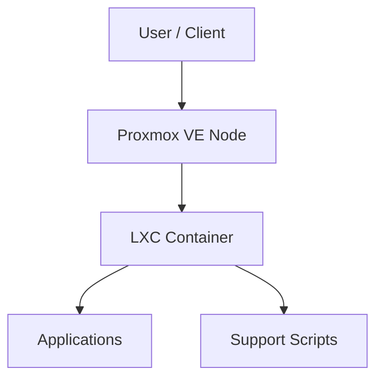

# Proxmox LXC Support

This repository provides configuration snippets and helper scripts to maintain LXC containers within a Proxmox VE environment.

## Component Relationships

## References

- [Proxmox VE Documentation](https://pve.proxmox.com/pve-docs/)
- [LXC Documentation](https://linuxcontainers.org/lxc/docs/)
